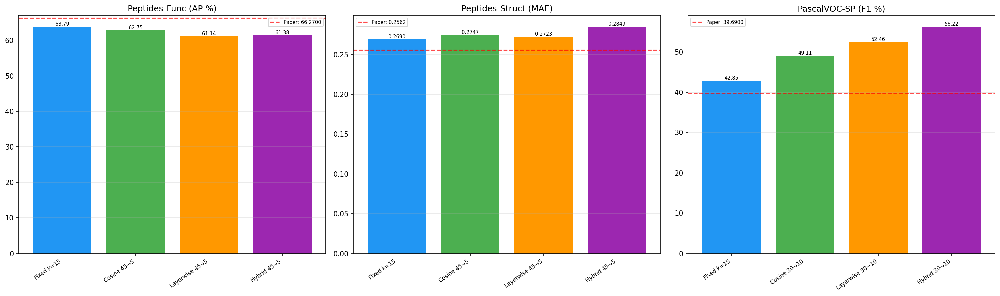
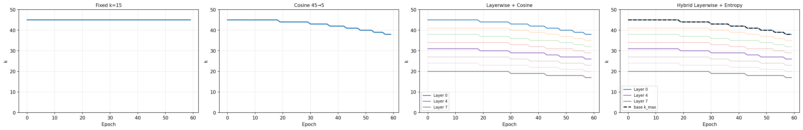
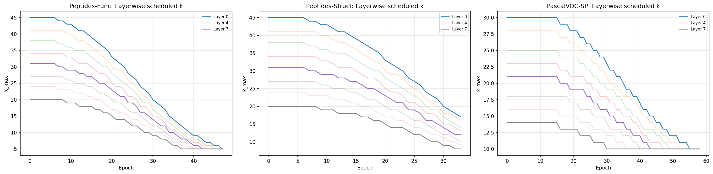
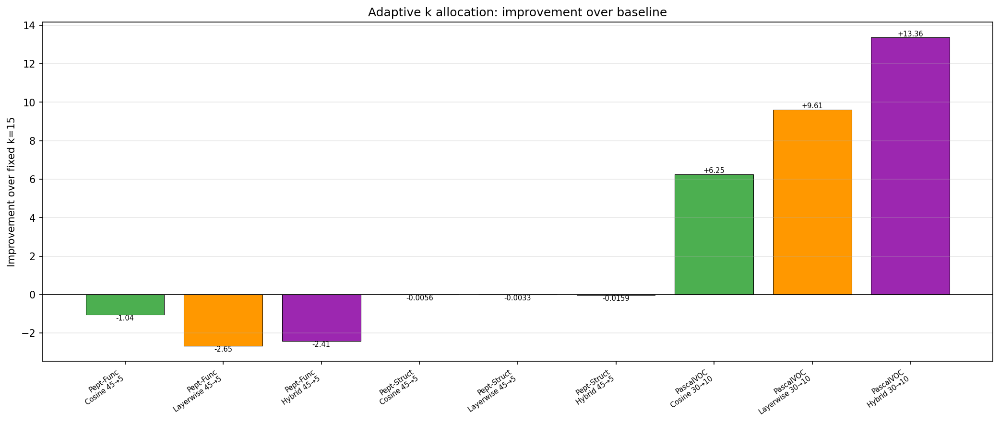
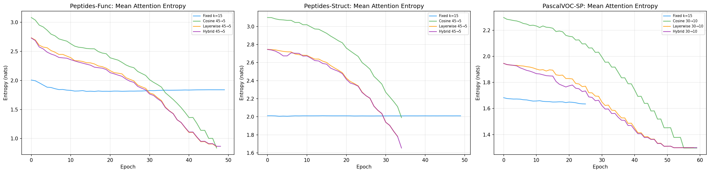
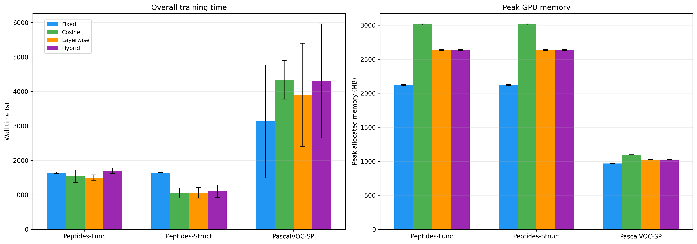

# Adaptive k-Allocation for k-MIP Attention in Graph Transformers

A compute-constrained empirical study of adaptive sparse attention schedules in GraphGPS.

This project extends  
**[k-Maximum Inner Product Attention for Graph Transformers and the Expressive Power of GraphGPS](https://arxiv.org/abs/2604.03815)**.

---

## Overview

Graph transformers are effective at modelling long-range interactions, but dense self-attention scales poorly on large graphs. k-Maximum Inner Product (k-MIP) attention addresses this by restricting each query to its top-$k$ keys, reducing the cost of global attention.

This project investigates whether **adapting $k$ during training** can improve performance over a fixed-$k$ baseline. In particular, it compares four $k$-allocation strategies within the **GraphGPS + k-MIP** framework:

- **Fixed $k$**
- **Global cosine annealing**
- **Layerwise cosine annealing**
- **Hybrid layerwise + entropy-adaptive allocation**

The central question is whether adaptive sparsification mitigates supervision starvation and improves predictive performance, especially on larger or more structurally diverse graph tasks.

---

## Key Results

The main finding is that **adaptive $k$-allocation is not universally better than a fixed-$k$ baseline**.

- On **Peptides-func** and **Peptides-struct**, **fixed $k = 15$** performed best in the three-seed summary.
- On **PascalVOC-SP**, the **hybrid adaptive method** achieved the strongest result:
  - **50.35 ± 5.66 F1** (hybrid adaptive)
  - **47.23 ± 7.53 F1** (fixed $k$)

This suggests that adaptive sparsification may be more useful on **larger, more complex graph tasks** than on smaller graph-level benchmarks.

### Representative run comparison



---

## Methods

### Base k-MIP attention

For node features $X \in \mathbb{R}^{N \times d}$, each attention head computes queries, keys, and values:

```math
Q^h = XW_Q^h, \qquad K^h = XW_K^h, \qquad V^h = XW_V^h
```

with score matrix

```math
S^h = \frac{1}{\sqrt{d_K}} Q^h (K^h)^\top
```

k-MIP keeps only the top-$k$ entries in each row before softmax:

```math
\tilde S^h_{ij} =
\begin{cases}
S^h_{ij}, & j \in \mathrm{TopK}_i(k) \\
-\infty, & \text{otherwise}
\end{cases}
```

and applies attention as usual:

```math
A^h_{ij} = \frac{\exp(\tilde S^h_{ij})}{\sum_{m=1}^{N} \exp(\tilde S^h_{im})}, \qquad \text{output} = A^h V^h
```

### Compared strategies

Let:
- $k_{\max}$ = initial attention budget
- $k_{\min}$ = minimum attention budget
- $t$ = epoch
- $T$ = total number of epochs
- $t_w$ = warmup epochs
- $l \in \{0, \dots, L-1\}$ = layer index
- $L$ = number of layers
- $\rho$ = deepest-layer ratio
- $\alpha$ = entropy exponent

---

### 1. Fixed $k$

A constant attention budget is used at every epoch and every layer:

```math
k_l^{(t)} = k = 15
```

This is the baseline used in all comparisons.

---

### 2. Global cosine annealing

A single epoch-dependent budget is shared across all layers.

For $t < t_w$:

```math
k_{\text{base}}(t) = k_{\max}
```

For $t \ge t_w$:

```math
k_{\text{base}}(t)
=
k_{\min}
+
\frac{1}{2}(k_{\max}-k_{\min})
\left(
1 + \cos\left(\pi \frac{t-t_w}{T-t_w}\right)
\right)
```

and the layer budget is uniform:

```math
k_l^{(t)} = \mathrm{round}(k_{\text{base}}(t))
```

Used in this project as:
- **Peptides:** $45 \rightarrow 5$
- **PascalVOC-SP:** $30 \rightarrow 10$

---

### 3. Layerwise cosine annealing

The same cosine base schedule is used, but it is scaled across depth so earlier layers keep larger budgets.

First compute the base schedule:

```math
k_{\text{base}}(t)
=
k_{\min}
+
\frac{1}{2}(k_{\max}-k_{\min})
\left(
1 + \cos\left(\pi \frac{t-t_w}{T-t_w}\right)
\right)
```

Then define a linear layer scale:

```math
s_l = 1 - (1-\rho)\frac{l}{L-1}
```

with $\rho = 0.45$, and assign each layer:

```math
k_l^{(t)} = \max\left(k_{\min}, \left\lfloor k_{\text{base}}(t)\, s_l \right\rceil \right)
```

This keeps shallow layers broader and makes deeper layers sparse earlier.

---

### 4. Hybrid layerwise + entropy-adaptive allocation

This combines:
- the **layerwise cosine schedule** above, and
- a **querywise entropy-adaptive** $k$ inside each layer.

First compute the layerwise budget:

```math
k_l^{(t)} = \max\left(k_{\min}, \left\lfloor k_{\text{base}}(t)\, s_l \right\rceil \right)
```

For query $i$, the attention entropy is:

```math
H(a_i) = -\sum_j a_{ij}\log a_{ij}
```

The normalized entropy score is:

```math
\bar H_i =
\left(
\frac{H(a_i)}{\log k_l^{(t)}}
\right)^\alpha
```

with $\alpha = 1.25$.

The final querywise budget is then:

```math
k_i = k_{\min} + \left\lfloor \big(k_l^{(t)} - k_{\min}\big)\bar H_i \right\rceil
```

So:
- **high-entropy / uncertain queries** receive larger $k$
- **low-entropy / already concentrated queries** receive smaller $k$

---

## Visualizing the scheduling strategies





---

## Experimental Setup

- **Framework:** GraphGPS + k-MIP
- **Datasets:**
  - Peptides-func
  - Peptides-struct
  - PascalVOC-SP
- **Model configuration:**
  - 8 layers
  - 4 attention heads
  - Hidden dimension: 52
  - GatedGCN local message passing
  - Two-layer output MLP
- **Training:**
  - AdamW optimizer
  - Cosine learning-rate decay
- **Compute setting:**
  - 3 random seeds
  - 50 epochs on Peptides benchmarks
  - 60 epochs on PascalVOC-SP
  - Compute-constrained study

---

## Results Summary (three-seed mean ± std)

| Method | Peptides-func (AP ↑) | Peptides-struct (MAE ↓) | PascalVOC-SP (F1 ↑) |
|--------|----------------------:|-------------------------:|--------------------:|
| Fixed $k = 15$ | **63.01 ± 0.67** | **0.2652 ± 0.0039** | 47.23 ± 7.53 |
| Cosine annealing | 61.14 ± 1.67 | 0.2784 ± 0.0056 | 47.99 ± 0.97 |
| Layerwise cosine | 60.77 ± 0.74 | 0.2812 ± 0.0085 | 49.63 ± 3.13 |
| Hybrid adaptive | 61.45 ± 0.48 | 0.2834 ± 0.0042 | **50.35 ± 5.66** |

### Improvement over fixed-$k$ baseline



---

## Mechanism Checks

### Attention entropy over training

Adaptive schedules consistently reduce attention entropy relative to the fixed baseline, showing that annealing makes attention progressively more selective.



### Runtime and memory trade-offs

Adaptive methods are not free: they can improve F1 on PascalVOC-SP, but often use more memory and may increase total wall-clock time depending on the stopping pattern.



---

## Main Takeaways

- **Fixed $k$ remained strongest** on the smaller peptide datasets.
- **Adaptive schedules helped most on PascalVOC-SP**, where the hybrid method performed best.
- **Entropy curves and layerwise $k$ profiles confirmed** that the schedules behaved as intended, even when performance gains were limited.
- **Runtime and memory trade-offs were dataset-dependent**:
  - On peptide tasks, adaptive methods often stopped earlier but used more peak memory.
  - On PascalVOC-SP, adaptive methods cost more overall but produced better F1.

---

## Repository Structure

```text
.
├── README.md
├── paper/
│   └── Adaptive_k_Allocation_for_k_MIP_Attention.pdf
├── notebooks/
│   └── kmips_extension.ipynb
├── results/
│   ├── attention_entropy_evolution.png
│   ├── improvement_over_baseline.png
│   ├── k_scheduling_strategies.png
│   ├── method_comparison_bars.png
│   ├── per_layer_k_profiles.png
│   ├── runtime_memory_bars.png
│   ├── all_lrgb_results.json
│   ├── three_seed_summary_table.csv
│   └── runtime_memory_table.csv
```

---

## Reproducibility Notes

This repository contains the paper, notebook, and result artifacts used for the study. The experiments were run in a **compute-constrained setting**, so this repository should be viewed as a transparent implementation record rather than a fully packaged benchmark suite.

Exact reproduction may require:
- the original GraphGPS / k-MIP environment
- the LRGB datasets
- compatible GPU resources
- matching seeds and training settings

---

## Limitations

This study is intentionally cautious in scope:

- only **3 seeds** were used
- training was limited to **50/60 epochs**
- the work is **compute-constrained**
- mechanism plots are shown from **representative runs**
- the study does not include a full hyperparameter sweep over schedule range, warmup, or patience

The conclusions should therefore be interpreted as a targeted empirical comparison rather than a definitive benchmark.

---

## Citation

If you reference this repository, please cite:

```bibtex
@misc{thuo2026adaptivekallocation,
  title={Adaptive k-Allocation for k-MIP Attention in Graph Transformers: A Compute-Constrained Empirical Study},
  author={John Thuo},
  year={2026}
}
```

---

## Acknowledgements

This project builds on prior work in:
- **GraphGPS**
- **k-MIP attention**
- **Long Range Graph Benchmark (LRGB)**

and was developed as part of a geometric deep learning mini-project on sparse attention in graph transformers.
